# 🏗️ Madza AI Healthcare Platform - Actual Architecture

## Real Implementation Diagram

Copy the code below and paste it into any Mermaid-compatible tool:

```mermaid
graph TB
    %% Frontend Layer
    subgraph FE["🖥️ REACT FRONTEND (Port 3000)"]
        direction TB
        DASH[📊 Dashboard<br/>Real-time Metrics & Activity]
        PAT_REG[👤 Patient Registration<br/>AI-Powered Onboarding]
        PAT_MGMT[👥 Patient Management<br/>View & Search Patients]
        CLAIM_PROC[📋 Claim Processing<br/>Multi-Step AI Workflow]
        CLAIM_MGMT[⚖️ Claim Management<br/>Approve/Deny with AI]
        OBS[📈 Observability<br/>System Monitoring]
        AGENT[🤖 Agent Status<br/>AI Performance Metrics]
    end

    %% Backend API Layer
    subgraph BE["⚙️ FLASK BACKEND (Port 5001)"]
        direction TB
        API[🔗 REST API<br/>15 Endpoints]
        HEALTH[❤️ /api/health]
        PAT_API[👤 /api/patient/*]
        CLAIM_API[📋 /api/claims/*]
        OBS_API[📊 /api/observability/*]
        AGENT_API[🤖 /api/agents/*]
        ACTIVITY[📝 /api/activity/*]
    end

    %% Business Logic Layer
    subgraph BL["🧠 BUSINESS LOGIC LAYER"]
        direction TB
        BEDROCK_SVC[🧠 BedrockService<br/>AWS Bedrock Integration]
        PAT_SVC[👤 PatientService<br/>Patient CRUD Operations]
        CLAIM_SVC[📋 ClaimService<br/>Claim CRUD & Management]
    end

    %% AI Processing Layer
    subgraph AI["🤖 AI PROCESSING LAYER"]
        direction TB
        PAT_AI[👤 Patient Registration AI<br/>Risk Assessment & Validation]
        CLAIM_AI[📋 Claim Processing AI<br/>Multi-Step Validation]
        DENIAL_AI[❌ Denial Analysis AI<br/>Reprocessing Suggestions]
        OBS_AI[📊 Observability AI<br/>System Health Monitoring]
    end

    %% AWS Cloud Layer
    subgraph AWS["☁️ AWS CLOUD"]
        direction TB
        BEDROCK[🧠 Amazon Bedrock<br/>Claude 3 Sonnet]
        BEDROCK_AGENT[🤖 Bedrock Agent<br/>Simple Process Orchestration]
        IAM[🔐 AWS IAM<br/>Security & Access]
    end

    %% Data Layer
    subgraph DATA["💾 DATA LAYER"]
        direction TB
        SQLITE[🗃️ SQLite Database<br/>Local Development]
        PAT_TBL[👤 Patient Table<br/>+ AI Analysis JSON]
        CLAIM_TBL[📋 Claim Table<br/>+ AI Analysis JSON]
    end

    %% Connections - Frontend to Backend
    DASH -.->|"HTTP Requests"| OBS_API
    DASH -.->|"HTTP Requests"| ACTIVITY
    PAT_REG -.->|"POST /api/patient/register"| PAT_API
    PAT_MGMT -.->|"GET /api/patients"| PAT_API
    CLAIM_PROC -.->|"POST /api/claims/process"| CLAIM_API
    CLAIM_MGMT -.->|"GET/PUT/POST /api/claims/*"| CLAIM_API
    OBS -.->|"GET /api/observability/*"| OBS_API
    AGENT -.->|"GET /api/agents/status"| AGENT_API

    %% Backend Internal Connections
    API --> BEDROCK_SVC
    API --> PAT_SVC
    API --> CLAIM_SVC
    HEALTH --> API
    PAT_API --> PAT_SVC
    CLAIM_API --> CLAIM_SVC
    OBS_API --> BEDROCK_SVC
    AGENT_API --> BEDROCK_SVC
    ACTIVITY --> BEDROCK_SVC

    %% Business Logic to AI
    PAT_SVC -->|"Triggers"| PAT_AI
    CLAIM_SVC -->|"Triggers"| CLAIM_AI
    CLAIM_SVC -->|"Triggers"| DENIAL_AI
    BEDROCK_SVC -->|"Triggers"| OBS_AI

    %% AI to AWS
    PAT_AI -->|"API Calls"| BEDROCK_AGENT
    CLAIM_AI -->|"API Calls"| BEDROCK_AGENT
    DENIAL_AI -->|"API Calls"| BEDROCK_AGENT
    OBS_AI -->|"API Calls"| BEDROCK_AGENT
    BEDROCK_AGENT -->|"LLM Inference"| BEDROCK
    BEDROCK_SVC -->|"Direct API"| BEDROCK
    BEDROCK_SVC -->|"Authentication"| IAM

    %% Data Connections
    PAT_SVC -->|"CRUD Operations"| PAT_TBL
    CLAIM_SVC -->|"CRUD Operations"| CLAIM_TBL
    PAT_TBL -->|"Stores Data"| SQLITE
    CLAIM_TBL -->|"Stores Data"| SQLITE

    %% Styling with better boxes
    classDef frontend fill:#e3f2fd,stroke:#1976d2,stroke-width:3px,color:#000,font-weight:bold
    classDef api fill:#f3e5f5,stroke:#7b1fa2,stroke-width:3px,color:#000,font-weight:bold
    classDef services fill:#e8f5e8,stroke:#388e3c,stroke-width:3px,color:#000,font-weight:bold
    classDef ai fill:#fff3e0,stroke:#f57c00,stroke-width:3px,color:#000,font-weight:bold
    classDef aws fill:#ffebee,stroke:#d32f2f,stroke-width:3px,color:#000,font-weight:bold
    classDef data fill:#f1f8e9,stroke:#33691e,stroke-width:3px,color:#000,font-weight:bold

    class DASH,PAT_REG,PAT_MGMT,CLAIM_PROC,CLAIM_MGMT,OBS,AGENT frontend
    class API,HEALTH,PAT_API,CLAIM_API,OBS_API,AGENT_API,ACTIVITY api
    class BEDROCK_SVC,PAT_SVC,CLAIM_SVC services
    class PAT_AI,CLAIM_AI,DENIAL_AI,OBS_AI ai
    class BEDROCK,BEDROCK_AGENT,IAM aws
    class SQLITE,PAT_TBL,CLAIM_TBL data
```

## How to Use This Diagram

### 1. **Mermaid Live Editor** (Recommended)
- Go to [https://mermaid.live/](https://mermaid.live/)
- Copy the code above and paste it into the editor
- Export as PNG, SVG, or PDF

### 2. **GitHub/GitLab**
- Create a `.md` file and paste the code
- GitHub will automatically render the diagram

### 3. **Notion**
- Use the `/mermaid` command and paste the code

## Real Implementation Details

This diagram accurately represents your **Madza AI Healthcare Platform** with:

### **🖥️ Frontend (React - Port 3000)**
- **7 Components**: Dashboard, Patient Registration, Patient Management, Claim Processing, Claim Management, Observability, Agent Status
- **Material-UI + Framer Motion** for modern UI
- **Real-time data** from backend APIs

### **⚙️ Backend (Flask - Port 5001)**
- **15 API Endpoints** covering all functionality
- **CORS enabled** for frontend integration
- **Health checks** and monitoring

### **🧠 Business Logic**
- **BedrockService**: AWS Bedrock integration with Claude 3 Sonnet
- **PatientService**: CRUD operations for patients
- **ClaimService**: CRUD operations and management for claims

### **🤖 AI Processing**
- **4 AI Agents**: Patient Registration, Claim Processing, Denial Analysis, Observability
- **JSON-only responses** for consistent parsing
- **Automatic approval/denial** based on AI analysis

### **☁️ AWS Cloud**
- **Amazon Bedrock** with Claude 3 Sonnet
- **Bedrock Agent** for simple orchestration
- **AWS IAM** for security

### **💾 Data Layer**
- **SQLite Database** for local development
- **Patient & Claim tables** with AI analysis stored as JSON
- **Real-time metrics** and activity tracking

**Data Flow**: Frontend → API → Services → AI Processing → AWS Bedrock → Database

This is the **actual working system** you built! 🚀
