# 🏗️ Madza AI Healthcare Platform - Simplified Architecture

## Simple Mermaid Diagram

Copy the code below and paste it into any Mermaid-compatible tool:

```mermaid
graph TB
    %% Frontend
    subgraph "🖥️ Frontend"
        UI[("🎨 React App<br/>Dashboard, Patient & Claim Management")]
    end

    %% Backend
    subgraph "⚙️ Backend"
        API[("🔗 Flask API<br/>REST Endpoints")]
        SERVICES[("🧠 AI Services<br/>Patient & Claim Processing")]
    end

    %% AI Layer
    subgraph "🤖 AI Agents"
        PAT_AI[("👤 Patient Agent<br/>Registration & Risk Assessment")]
        CLAIM_AI[("📋 Claim Agent<br/>Processing & Validation")]
    end

    %% AWS Cloud
    subgraph "☁️ AWS Cloud"
        BEDROCK[("🧠 Amazon Bedrock<br/>Claude 3 Sonnet")]
        AGENTS[("🤖 Agent Orchestration<br/>Bedrock + Strands")]
    end

    %% Data
    subgraph "💾 Data"
        DB[("🗃️ SQLite Database<br/>Patients & Claims")]
    end

    %% External
    subgraph "🌍 External"
        HEALTHCARE[("🏥 Healthcare Providers")]
        INSURANCE[("🏦 Insurance Companies")]
    end

    %% Connections
    UI --> API
    API --> SERVICES
    SERVICES --> PAT_AI
    SERVICES --> CLAIM_AI
    PAT_AI --> AGENTS
    CLAIM_AI --> AGENTS
    AGENTS --> BEDROCK
    SERVICES --> DB
    PAT_AI -.-> HEALTHCARE
    CLAIM_AI -.-> INSURANCE

    %% Styling
    classDef frontend fill:#e3f2fd,stroke:#1976d2,stroke-width:3px
    classDef backend fill:#f3e5f5,stroke:#7b1fa2,stroke-width:3px
    classDef ai fill:#fff3e0,stroke:#f57c00,stroke-width:3px
    classDef aws fill:#ffebee,stroke:#d32f2f,stroke-width:3px
    classDef data fill:#e8f5e8,stroke:#388e3c,stroke-width:3px
    classDef external fill:#fce4ec,stroke:#c2185b,stroke-width:3px

    class UI frontend
    class API,SERVICES backend
    class PAT_AI,CLAIM_AI ai
    class BEDROCK,AGENTS aws
    class DB data
    class HEALTHCARE,INSURANCE external
```

## How to Use This Diagram

### 1. **Mermaid Live Editor** (Recommended)
- Go to [https://mermaid.live/](https://mermaid.live/)
- Copy the code above and paste it into the editor
- Export as PNG, SVG, or PDF

### 2. **GitHub/GitLab**
- Create a `.md` file and paste the code
- GitHub will automatically render the diagram

### 3. **Notion**
- Use the `/mermaid` command and paste the code

## Architecture Overview

This simplified diagram shows your **Madza AI Healthcare Platform** with:

- **🖥️ Frontend**: React app with all UI components
- **⚙️ Backend**: Flask API and AI services
- **🤖 AI Agents**: Patient and Claim processing agents
- **☁️ AWS Cloud**: Bedrock and agent orchestration
- **💾 Data**: SQLite database
- **🌍 External**: Healthcare and insurance systems

**Data Flow**: Frontend → API → Services → AI Agents → AWS → Database

Perfect for presentations and documentation! 🚀
