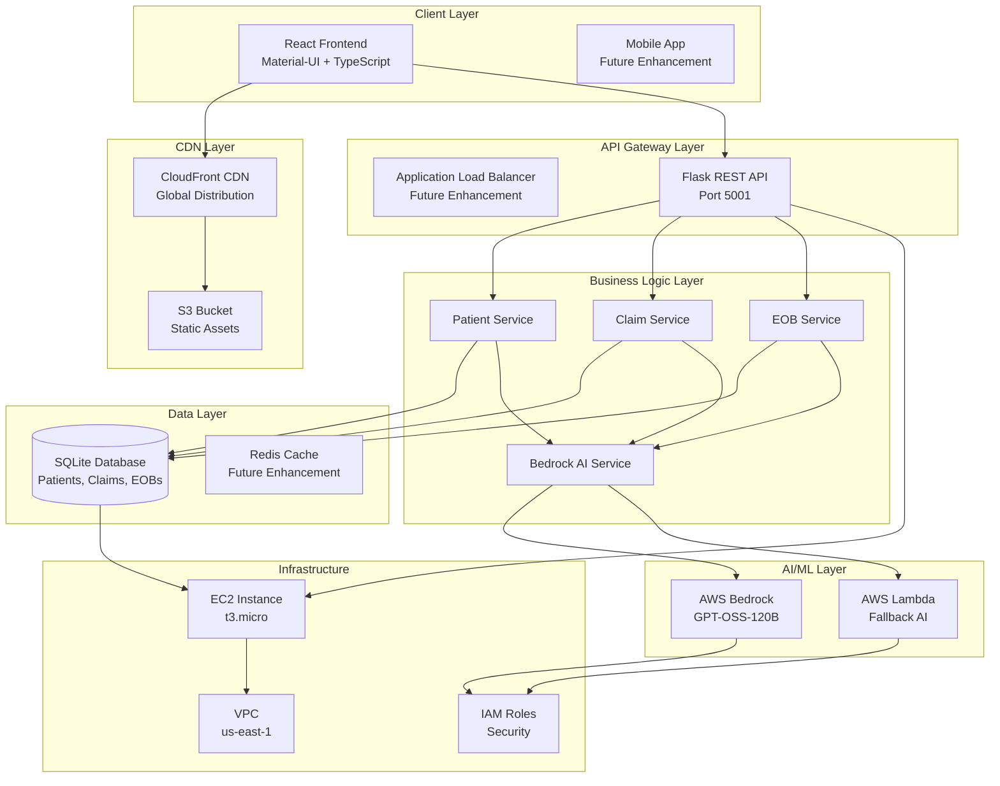
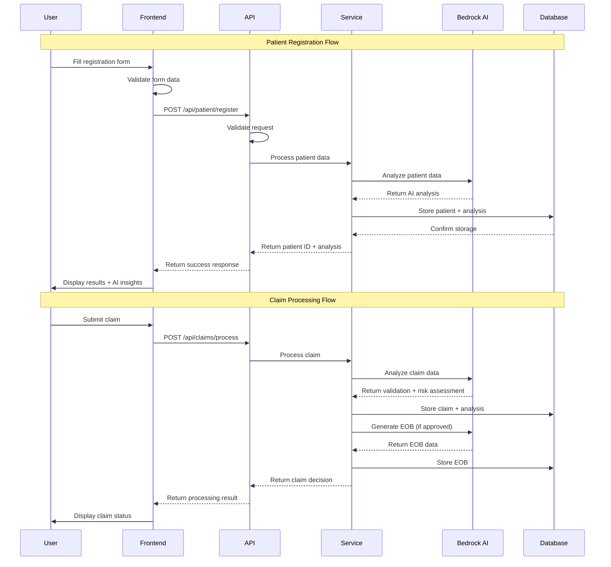
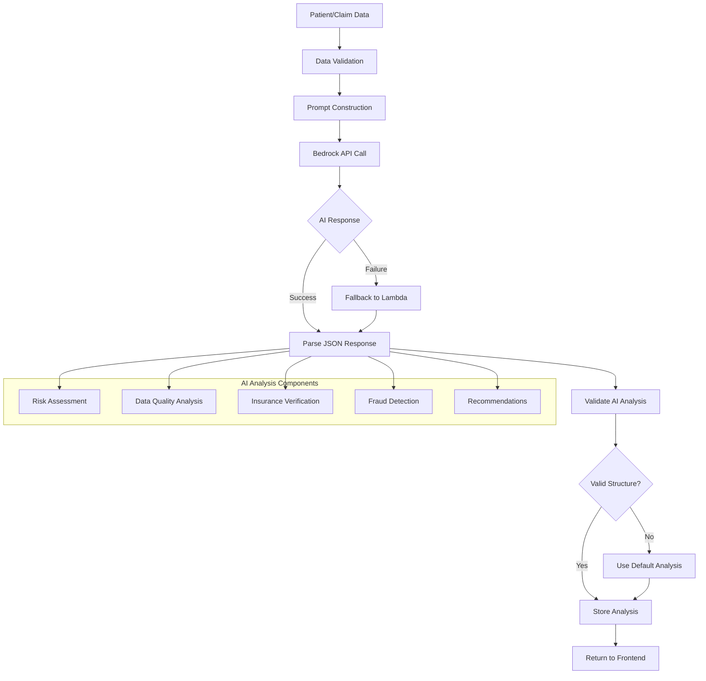
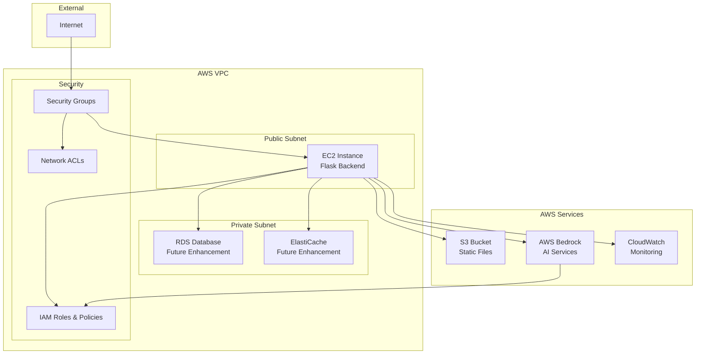
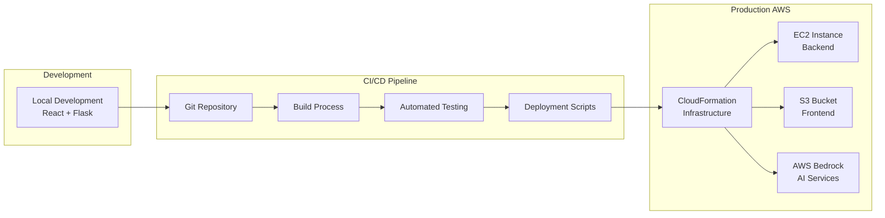
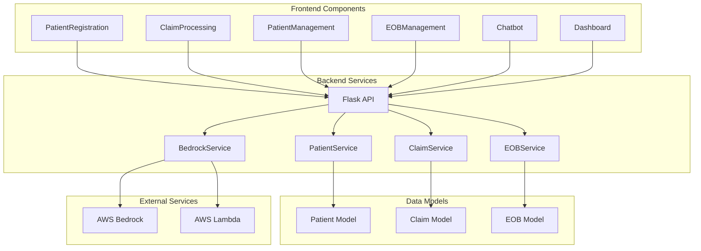
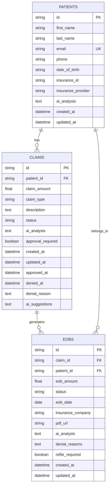

# Madza AI Healthcare Platform - Architecture Diagram

## System Architecture Overview

## Data Flow Diagram

## AI Analysis Flow

## Security Architecture

## Deployment Architecture

## Component Interaction Diagram

## Database Schema

This comprehensive architecture documentation provides a complete overview of the Madza AI Healthcare Platform, including visual diagrams that illustrate the system's structure, data flow, and component interactions.
